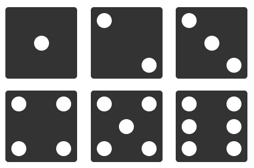

# Challenge n°6
Intitulé : **Flexdices**  
https://github.com/O-clock-Explorer/Challenge-flexdices

Guillaume DURAND  
Promo : Explorer  
S2-J1 | 09/10/2017

Formateur : Lucie  
Type : Flexbox

## Objectif
Uniquement via du CSS, dessiner les 6 faces d'un dés en utilisant les flexbox.

